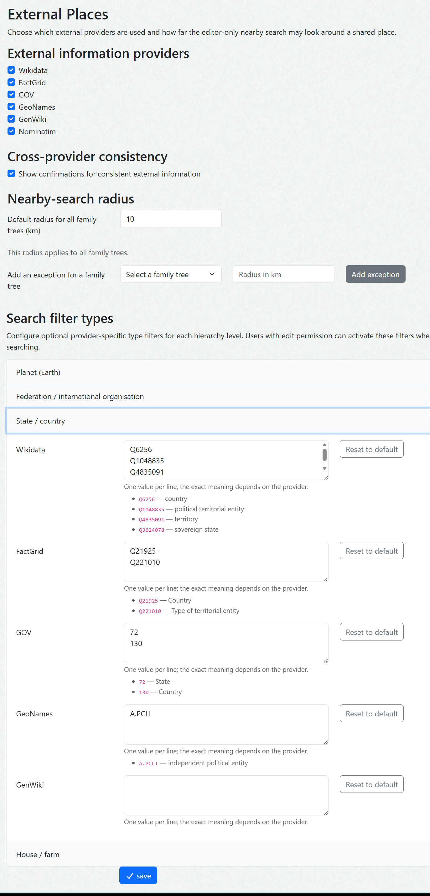
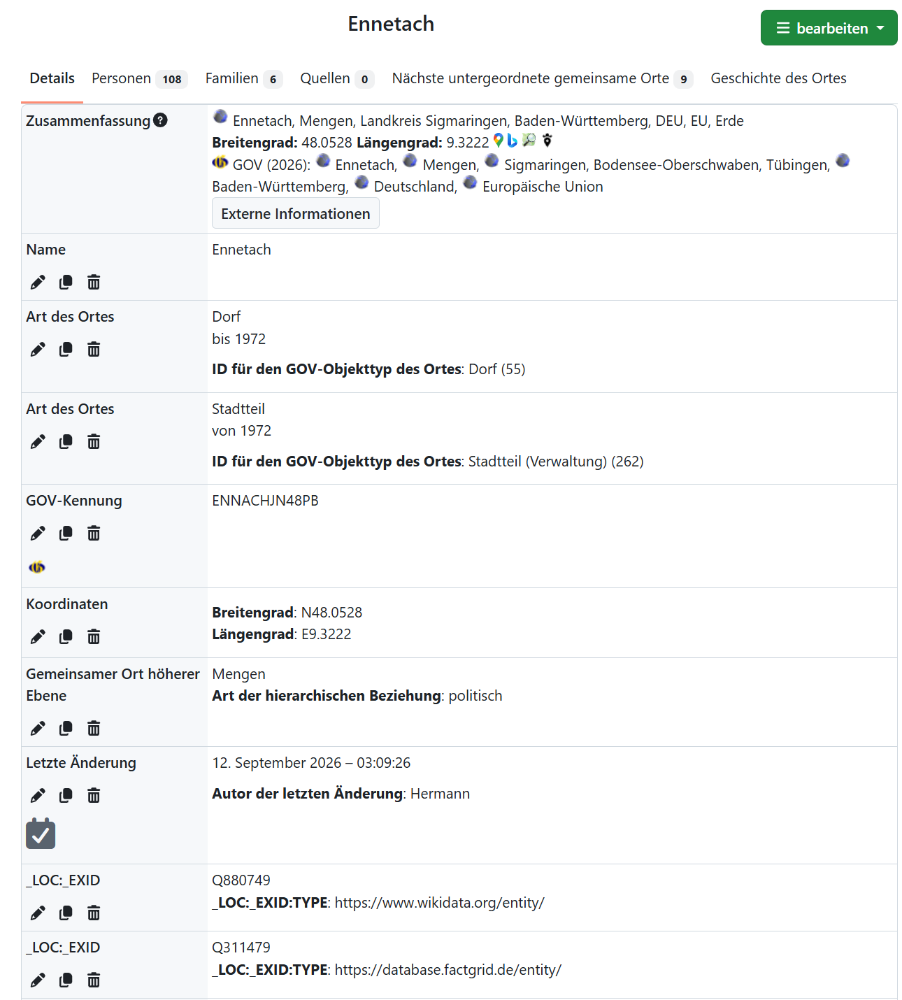
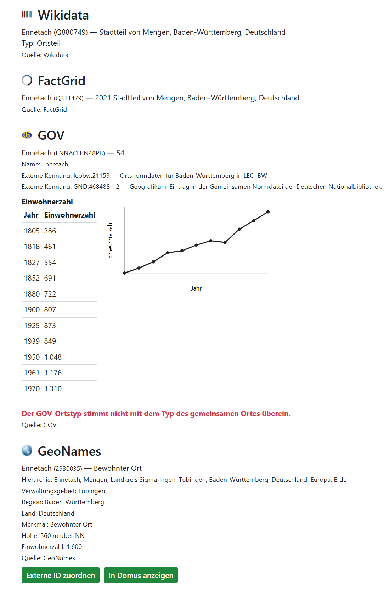
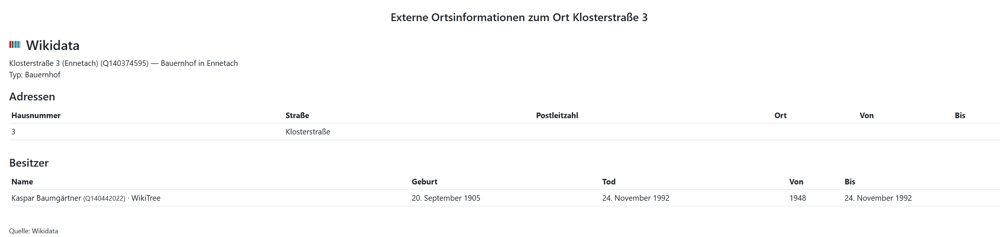
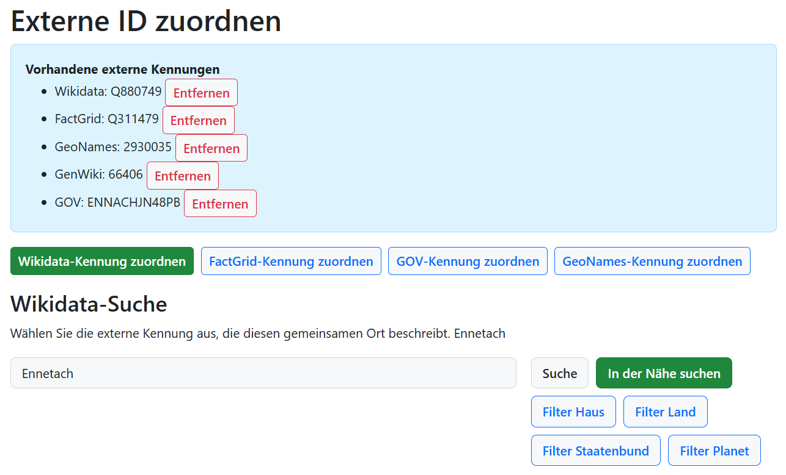
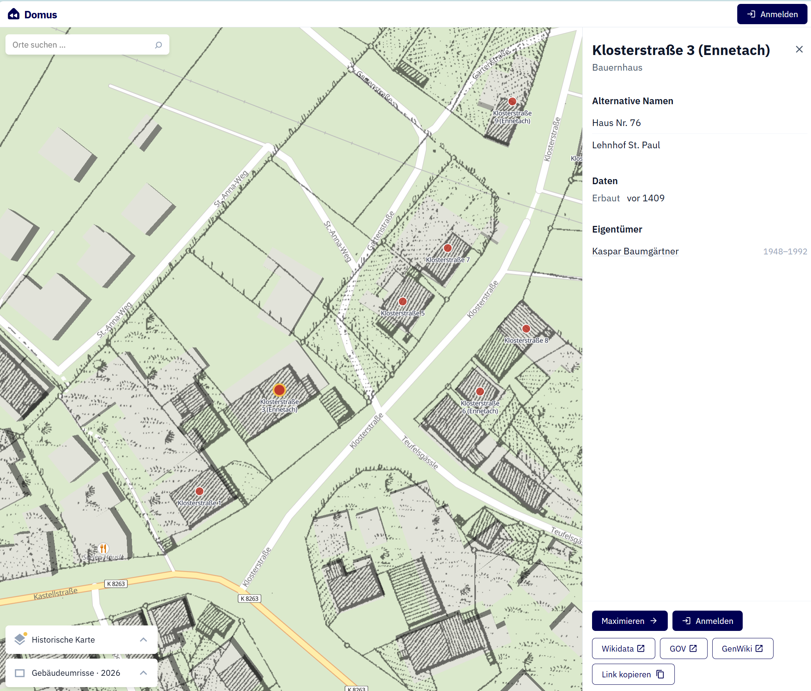

# **webtrees** module: External Places


[](version.txt)
[](https://github.com/hartenthaler/hh_external_places/releases)
[](https://www.gnu.org/licenses/gpl-3.0)

External Places is a [webtrees](https://www.webtrees.net) module for enriching [Vesta Shared Places](https://github.com/vesta-webtrees-2-custom-modules/vesta_shared_places) (`_LOC`) with public information from Wikidata, FactGrid, GOV, GeoNames and optionally Nominatim/OpenStreetMap. The module focuses on houses, farms and other inhabited buildings, while remaining usable for every kind of shared place. Administrators can enable or disable providers and configure a global nearby-search radius with optional exceptions for individual family trees. Editors can assign and compare external place identifiers, search each provider and inspect cached details. After review, selected external identifiers or information can explicitly be transferred into the shared-place record.

## 📚 Contents

* [Purpose](#-purpose)
* [Main features](#-main-features)
* [Screenshots](#-screenshots)
* [Domus (Wikidata)](#-domus-wikidata)
* [Privacy](#-privacy)
* [Requirements](#-requirements)
* [Installation](#-installation)
* [Usage](#usage)
* [Documentation](#-documentation)
* [Translation](#-translation)
* [Credits](#-credits)
* [License](#-license)

## 🎯 Purpose

A shared place can represent a building, farm, church, cemetery, street, square, district, village or another real-world place.
The module stores validated external identifiers alongside the shared-place record and displays provider-specific public information such as
names, descriptions, types, images, addresses, relationships, external references and population data where available.

The module does not synchronise with Wikidata, FactGrid or GOV and does not send genealogical person data to these services.
Assigning, replacing or removing an identifier, or transferring a reviewed value into the shared-place record,
is always an explicit action by a user who may edit the shared place.

Wikidata, FactGrid, GOV and GeoNames use fixed provider adapters.
Their public cross-references can be checked for consistency; missing identifiers are added only after an editor explicitly submits them.
See [External providers and identifier consistency](docs/EXTERNAL_PROVIDERS.md).

## 🏠 Domus (Wikidata)

[Domus](https://domus.genealogy.net) is an open application for researching the history of houses and buildings. It complements webtrees: webtrees remains the place for private genealogical data, while Domus can provide specialised public research and map views.
**Show in Domus** opens the linked Wikidata item in Domus in a new browser tab.
Without a Wikidata link, it opens the Domus map start page.
Domus is a separate public research application; the module only provides links to it.

## ⚙️ Main features

The current release provides:

* recognising typed Wikidata and FactGrid QIDs, GOV, GenWiki and GeoNames IDs;
* loading and caching public information from Wikidata, FactGrid, GOV, GenWiki, GeoNames and Nominatim;
* provider-specific searches (including GenWiki article search) and nearby searches where the provider supports them;
* assigning, replacing and removing identifiers explicitly, without automatic GEDCOM changes;
* checking cross-references between providers and showing whether they are consistent;
* filtering provider searches by hierarchy level: house/farm, country, federation/international organisation, or planet;
* showing historical addresses, owners and occupants from Wikidata or FactGrid;
* showing a localized GeoNames parent hierarchy and translated type labels;
* searching public people and organisations associated with external places;
* linking displayed external people to their provider records and, when available, to WikiTree (`P2949`);
* configuring enabled providers and one global nearby-search radius with optional tree exceptions; and
* opening linked Wikidata places in Domus.

## 🖼️ Screenshots

The screenshots below show the main workflows. The shared-place summary keeps
the local genealogy record in webtrees and presents links to the module's dedicated pages.

### Administration and search filters

Administrators can enable the external information providers and configure
their optional search filters. For every hierarchy level (house/farm, country,
federation or international organisation, and planet), each provider has a
list of typical type values that an editor can use to narrow a search. These
provider- and level-specific lists are shown in collapsible accordion panels;
each panel can be opened or closed independently and its values can be reset
to the provider defaults.



### Linking a shared place

The **External pages** action is available on the standard Vesta shared-place
page (see summary section). The `EXID` tags (introduced with GEDCOM 7) link to external databases.



### Provider information and consistency

The information page groups public data by provider. It also reports missing
or inconsistent values that may need to be reviewed in the shared-place
record.



### Addresses and related people

When Wikidata provides addresses or people connected with a place, such as
owners, the module displays these additional details as well.



### Searching and assigning an external ID

Editors can search each provider by name or by geographic radius.
Result lists can be filtered for the relevant hierarchy level when a provider returns many matches.



### Domus integration

Linked Wikidata places can be opened in [Domus](https://domus.genealogy.net).
The Domus view can expose links to GOV and GenWiki, overlay historical maps,
and show Wikidata residents or owners for houses and farms where available.



## 🔒 Privacy

When an external entry is loaded, the server requests only the validated identifier and requested display language.
Nearby searches send the shared place's coordinates and configured radius to the selected provider.
Standard technical request metadata is sent by the server. The module never sends names of living people,
family relationships, private notes, sources or other genealogical data.

Provider coordinates are normalised to WGS84 and compared with the shared
place using a provider-neutral great-circle distance. The hierarchy levels,
tolerances and coordinate-import rules are documented in
[Coordinates and consistency](docs/COORDINATES.md).

Responses are cached locally. If a provider is temporarily unavailable, the normal Vesta Shared Place page remains available.
When the optional Legal Notice module is active, it includes the selected external providers in the generated privacy policy together with the purpose of the request and the transferred technical data.

## 📌 Requirements

* webtrees 2.2.x
* Vesta Shared Places
* PHP with HTTPS access to the selected provider APIs for live enrichment; cached data remains usable while offline

## 📥 Installation

Install and use [Custom Module Manager](https://github.com/Jeferson49/CustomModuleManager)
for a convenient installation of webtrees custom modules:

1. Open **Control panel / Modules / Custom Module Manager** in webtrees.
2. Find **External Places** and click **Install module**.

**Manual installation**:

1. Download the [latest release](https://github.com/hartenthaler/hh_external_places/releases/latest).
2. Unzip it into the `modules_v4` directory of your webtrees installation.
3. Ensure that the directory is named `hh_external_places`.
4. In the webtrees control panel, enable **External Places**.

## Usage

External provider data is available from the shared-place page through the
**External information** link. This dedicated page uses the normal webtrees
layout, identifies the place in its heading and links back to the shared-place
record. It keeps provider details, cross-reference checks, population data and
assignment actions together.

An editor can use **Assign external identifier** on the shared-place page. The provider-specific sections offer search and, where supported, nearby search; the editor must explicitly choose the result. The module stores a selected provider identifier as a typed external identifier. For example, a GeoNames assignment uses the numeric GeoNames ID:

```gedcom
1 _EXID 2930035
2 TYPE https://www.geonames.org/
```

If an existing item has been merged or redirected by Wikidata, the assignment page shows the replacement QID and lets the editor apply it explicitly.

For a shared place with GEDCOM `MAP`, `LATI` and `LONG` coordinates, editors can also use **Search nearby**. The module shows at most 20 candidates inside the configured radius. It ranks suggestions by matching name and distance, but never creates a link automatically. Administrators can set one radius for all family trees and add exceptions only where a tree needs a different value; the selected value is used consistently for nearby searches in Wikidata, FactGrid and GOV.

Search results use a compact table. They show the provider label and identifier, the description and—where applicable—distance. Opening a result uses the provider's public page; **Assign** remains an explicit editor action.

Administrators can maintain provider-specific type lists for eight hierarchy
levels: house/building, locality, municipality, county, state, country,
federation/international organisation, and planet. The lists are presented in
an accordion, and each provider has a **Reset to default** action. On the
assignment page, editors are offered only the filter matching an unambiguous
shared-place classification. If the place type is missing, unknown or
contradictory, all filter buttons remain available; the unfiltered search is
always possible. Nearby-search buttons are disabled until the shared place has
valid coordinates; a tooltip explains what is missing.

GOV type labels come from the complete public vocabulary snapshot in
[`resources/config/gov-types.owl`](resources/config/gov-types.owl), not only
from the initial filter defaults. See [the GOV type catalogue
documentation](docs/GOV_TYPE_CATALOG.md) for provenance and updates.

When Wikidata provides address statements, the shared-place page shows a read-only address table with house number, street, postal code, place and optional validity dates. It is intentionally omitted for items without address data, such as most settlements or administrative areas.

Where Wikidata or FactGrid contains them, the same panel also shows public owners and occupants. These are external facts: no webtrees person is linked, changed or created. The table gives the public name and provider link, known birth/death dates, the period of the relationship and available WikiTree links.
GOV may provide several historical population figures. They are displayed as a
chronologically sorted table with a compact line chart, using the user's
webtrees number formatting. Additional GOV external identifiers are shown with
their configured meaning and, where a public URL template is known, as links.

## 📖 Documentation
* [Concept: Wikidata and Domus integration](docs/WIKIDATA_DOMUS_CONCEPT.md)
* [External providers and identifier consistency](docs/EXTERNAL_PROVIDERS.md)
* [Coordinates and consistency](docs/COORDINATES.md)
* [GOV type catalogue](docs/GOV_TYPE_CATALOG.md)
* [Module and repository naming proposal](docs/RENAME_PROPOSAL.md)
* [Roadmap](docs/ROADMAP.md)
* [Development notes](docs/DEVELOPMENT.md)
* [Historical address model](docs/HISTORICAL_ADDRESSES.md)
* [Owner and occupant metadata](docs/OWNER_AND_OCCUPANT_METADATA.md)
* [Version 2 roadmap](docs/ROADMAP.md)
* [Changelog](CHANGELOG.md)

## 🌐 Translation

The module uses the standard webtrees gettext system (`.po`/`.mo`) for its
user interface: headings, buttons, messages and other operating texts are
translated through `resources/lang`. GOV object types are not maintained as
interface strings; their multilingual labels come from the
bundled source `resources/config/gov-types.owl`. See [the GOV type catalogue
documentation](docs/GOV_TYPE_CATALOG.md) for the source and fallback rules.
German is currently available. Contributions are welcome as pull requests.

## 🙏 Credits

* [webtrees](https://www.webtrees.net)
* [Vesta Shared Places](https://github.com/vesta-webtrees-2-custom-modules/vesta_shared_places)
* David Straub for developing [Domus](https://domus.genealogy.net), and the Domus community
* [Wikidata](https://www.wikidata.org) and [Wikimedia Commons](https://commons.wikimedia.org)
* [FactGrid](https://database.factgrid.de) and [GOV](https://gov.genealogy.net)
* GeoNames, GOV, Nominatim, ...

## ⚖️ License

This module is licensed under [GPL-3.0-or-later](LICENSE).
